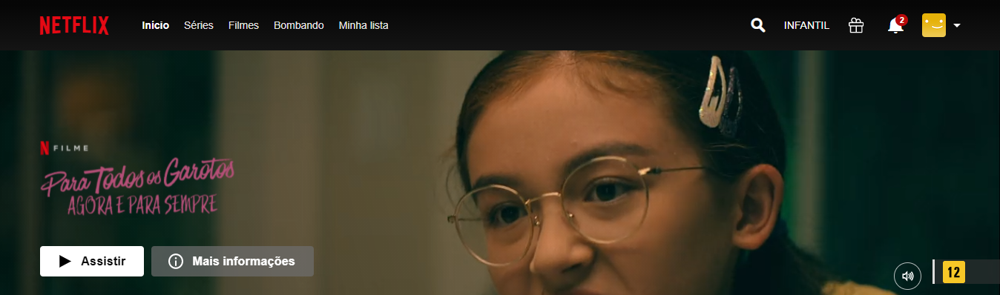
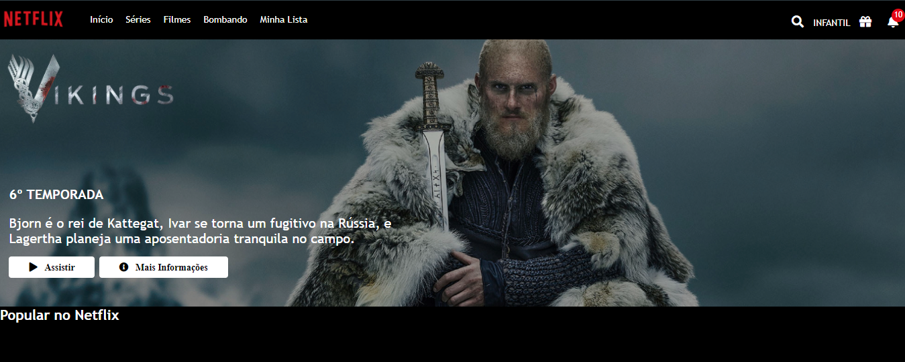
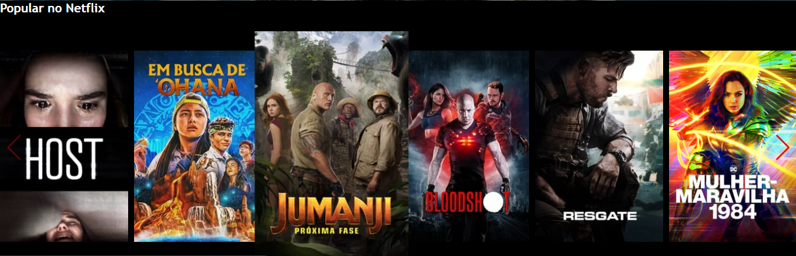

<div align="center" >
  
</div>
<!-- ************************************* Baadges ********************************************* -->
<p align="center">
  
  
  <a href="https://github.com/tgmarinho/nlw1/commits/master">
  
  </a>
</p>

---
 

<!-- ************************************* Title ********************************************* -->

<h1>  Recreating the Netflix Interface </h1>

----

<!-- ************************************* About the project ********************************************* -->

<h2>  About the project </h2>

---
<p align=" justify" >Rereading the interface of the main world streaming site using simple technologies such as HTML5, CSS3 and JavaScript. In this project I structured the layout, using CSS3 techniques through containers and variables, positioned the elements with Flexbox and used a Jquery plugin to make the carousel.
</p>

---
<h3> Languages / Frameworks / Libraries </h3>

* HTML 5
* CSS 3 
* JavaScript
* JQuery
* [Swiper](https://swiperjs.com/) - Plugin used for the slide effect on the carousel
* [Font Awesome](https://fontawesome.com/) - Fonts used in the project.

<h3> Tools </h3>

* [Visual Studio Code](https://code.visualstudio.com/) - Development IDE.

<h2>  Project Images </h2>

<div align="center" >
  
</div>
<div align="center" >
  
</div>
</br>

<h3> Running the Project </h3>

```bash
# Clone this repository
$ git clone https://github.com/devCarlosHenSil/projeto-netflix-modified.git

# Access the project folder
$ cd projeto-netflix-modified

# run the file
./index.html
```

<h3 id="referencias"> ⚓ Referências</h3>

* [Digital Innovation](https://web.digitalinnovation.one/track/avanade-angular-developer) - Avanade Angular Developer

---
with ❤️ for [Carlos Henrique](https://github.com/devCarlosHenSil) :punch: